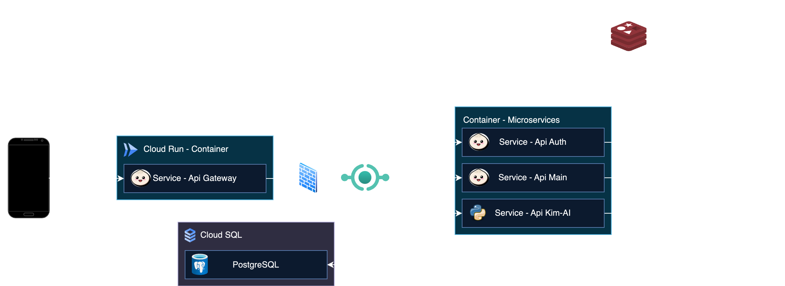
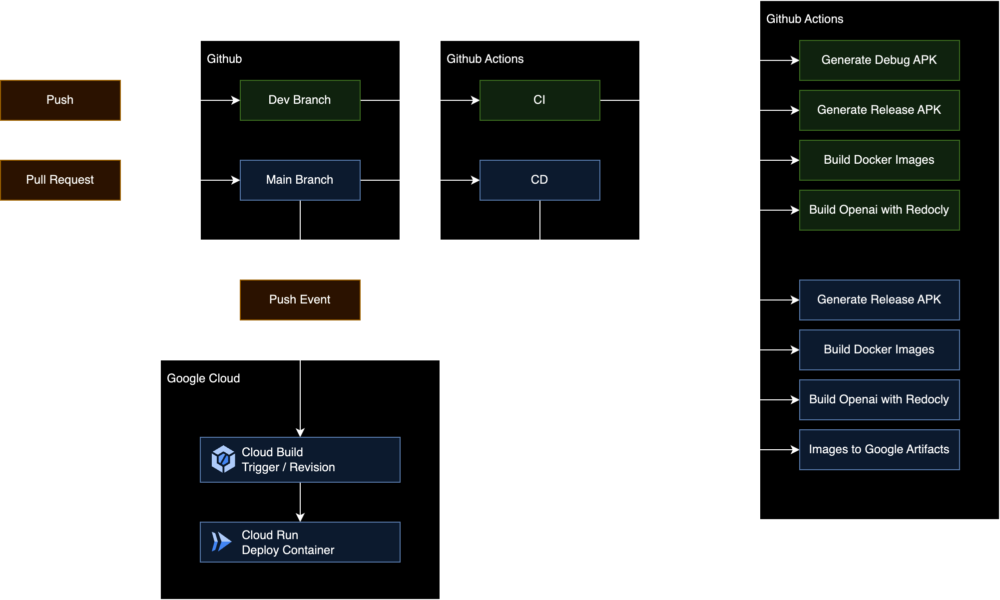
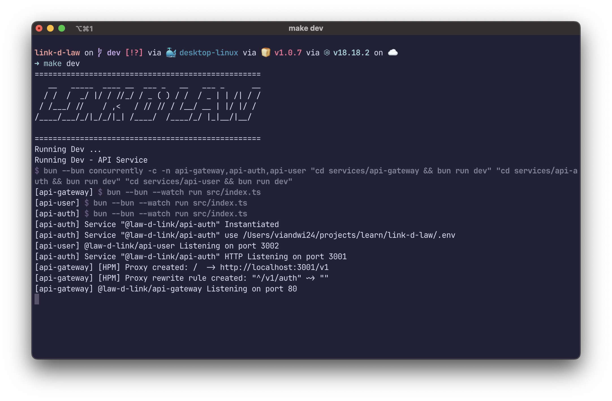

# L!nk D' Law
L!nk D' Law is a web and mobile application that can be used to find the best lawyer and what kind of lawyer you need based on your case.

## Directory Structure
- `apps` - contains all the apps
    - `mobile-android` - mobile app for android
    - `web` - web app (optional)
- `cache` - contains all the cache from data processing
- `datasets` - contains all the datasets used for training
- `docker` - contains dockerfile for dev, staging, and production
- `packages` - contains dependencies for all the apps or services
- `playground` - contains all the experimental code (jupyter notebook, etc)
- `prisma` - database schema, migration, and seed with prisma
- `services` - contains all the services
    - `api-gateway` - api service for handling all the api request
    - `api-auth` - api service for handling authentication
    - `api-main` - api service for handling main features

## Concept using of this architecture
- Monorepo
- Microservice
- Unit Testing
- CI/CD (Continuous Integration/Continuous Deployment)
- ...

## Text Editor
i recommend to use this text editor for development:
- [Visual Studio Code](https://code.visualstudio.com/)
- Open this project with VSCode, and you will get a notification to install all the recommended extensions for this project. click install all.

## Development Guide
[Development Guide](DEVELOPMENT.md)

## Contributing Guide
[Contribute Guide](CONTRIBUTING.md)

## Architecture


### Continuous Integration & Continuous Deployment Architecture


### Automate with Makefile

available command:
- `make setup-dev` - setup development environment with docker
- `make dev-docker` - run development environment with docker
- `make dev-api` - run all api services
- `make build` - build all the services into bin
- `make build-docker-images-prod` - build all the services into docker images for production
- `make run <service_name>` - run a builded bin service

### Monorepo Structure
```
packages/
├─ services/
├─ schema/
services/
├─ api-gateway/
│  ├─ src
|  |  ├─ index.ts
├─ api-main/
│  ├─ src
|  |  ├─ index.ts
├─ api-auth/
│  ├─ src
|  |  ├─ index.ts
├─ kim-ai/
│  ├─ src
|  |  ├─ main.py
```
this project using monorepo structure, so all the services and packages are in the same repository.
- `packages` - contains all the packages that can be used by all the services, like for reusable code, etc.
- `services` - contains all the services that will be used in this project.
all service mostly using typescript, so we use bunjs as runtime and using bunjs workspace to manage our monorepo.

## Copyrigth
&copy; 2021 [Nakama Capstone](https://github.com/Nakama-Capstone)
